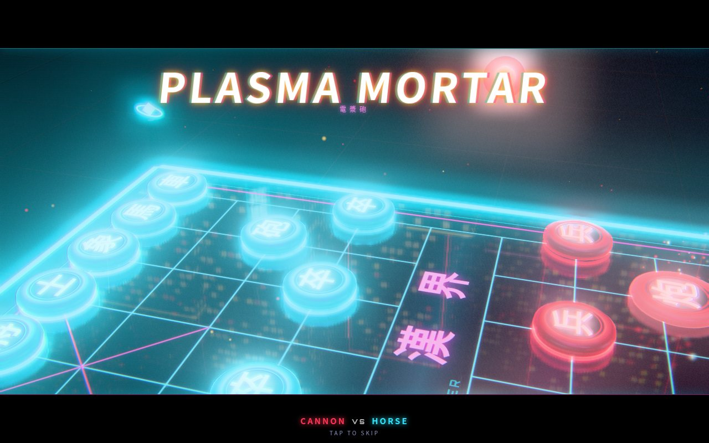

# 賽博棋鬥 CYBER BOARD

> 四合一 3D 賽博朋克棋盤對戰 · 4-in-1 cyberpunk 3D board battles · 國際象棋 / 中國象棋 / 黑白棋 / 飛行棋 · 每次食子都觸發霓虹對決動畫 · Three.js · 手機優先

**試玩 Play:** https://fung2222.github.io/cyber-board/ · **自動示範 Demo:** https://fung2222.github.io/cyber-board/?demo=1



## 遊戲 Games
| | 遊戲 | 特色 |
|---|---|---|
| ♞ | **國際象棋 CHESS** | 完整規則：王車易位、吃過路兵、升變（自選）、將死／困斃、三次重複、五十步、子力不足 |
| 炮 | **中國象棋 XIANGQI** | 九宮、楚河漢界、將帥不可對面、炮隔子打、蹩馬腳、塞象眼；困斃＝輸 |
| ◐ | **黑白棋 FLIP** | 夾住即翻；每條被夾嘅線以連鎖閃電逐粒翻轉，奪角有大爆發 |
| ✈ | **飛行棋 SKY RACE** | 2–4 色（電腦補位）、擲 6 起飛、準確步數返基地、同色格加速、踩中對手觸發空戰送佢返機庫 |

**食子對決 CAPTURE BATTLES：** 每次食子，鏡頭俯衝埋身，攻擊方用自己兵種專屬招式（兵：旋風刃、馬：流星踏、車：攻城衝、炮：電漿迫擊、后：霓虹風暴…）打碎對方，有 hit-stop、震屏、慢鏡、連擊字。1–2.5 秒，撳一下即跳過；設定可揀 完整／快速／關閉。

**無盡之塔 ENDLESS TOWER：** 每款遊戲各自一座無限高嘅塔：AI 角色越嚟越強、程式生成殘局／限步吃子／障礙格／獵殺任務，每 5 層首領＋檢查點，每 10 層塔主「零式」＋里程碑，解鎖棋子外觀，記錄最高樓層。

另有：8 個原創 AI 角色（各有性格、對白）、雙人同機（可自動轉棋盤）、表情、提示、悔棋。

## English
**CYBER BOARD** packs four board games into one neon Hong Kong rooftop: full-rules **Chess**, full-rules **Xiangqi**, the disc-flipping **Flip** and the dice race **Sky Race**. Every capture launches a short, skippable **capture battle** — the camera swoops in and the attacker performs a move unique to its piece type before the victim shatters into neon shards. Flip turns each outflanked line into a chain-lightning cascade; landing on a rival plane in Sky Race starts a dogfight. Each game has an **endless tower** of ever-stronger AI personalities, procedural challenges, bosses, checkpoints and milestone skins. Play vs AI (5 levels, 8 characters) or local pass-and-play. Bilingual (Traditional Chinese / English) with an in-game toggle.

## 語言 Language
撳右上角「EN／中」或者設定入面切換，會記住（`localStorage cyber.lang`，所有 CYBER 遊戲共用）。網址加 `?lang=en` / `?lang=zh` 亦可。

## 操作 Controls
撳棋子再撳目標格（綠點＝可走，紅圈＝可食）。飛行棋撳「擲骰」或者棋盤中間粒骰。對決動畫期間撳任何位置跳過。
視角：單指拖動旋轉／傾斜棋盤（輕撳照樣揀棋走棋）、雙指縮放、放大後雙指拖動平移、雙指扭轉亦可旋轉（有上下限，棋盤唔會反轉）；電腦用滑鼠拖動（左鍵／右鍵／`Ctrl`）旋轉、滾輪縮放；右下角「視角」掣還原。
Camera: drag with one finger to rotate/tilt (a quick tap still moves), pinch to zoom, two-finger drag to pan when zoomed, twist also rotates (all clamped); desktop drag to rotate + wheel zoom; the VIEW button resets.
鍵盤：`Esc`/`P` 暫停 · `U` 悔棋 · `H` 提示 · `Space`/`Enter` 擲骰／跳過動畫 · `+`/`-` 縮放 · `V` 還原視角。

## 網址參數 URL flags
`?demo=1`（`&game=xiangqi|flip|sky`）AI 對 AI 示範 · `?lang=en|zh` · `?fps=1` · `?quality=low` · `?adsim=1` · `?reset=1`

## 技術 Tech
Three.js r169 + [cyber-kit](https://github.com/fung2222/cyber-kit) **v0.3.0**（`vendor/cyber-kit/`，含 i18n），冇 build step。規則引擎、AI（alpha-beta 搜尋喺 Web Worker 入面行）、棋子模型、音效全部原創、程式生成。冇使用任何商標名稱（「Flip」「Sky Race」係原創英文名）。

## 開發 Development
```bash
python3 -m http.server 18977            # any free port, then open http://127.0.0.1:18977/
node tests/rules.test.mjs               # 82 rules / perft / AI / tower tests
node tests/view.test.mjs                # 30 camera clamp / damping / tap-vs-drag tests
/workspace/.venv-pw/bin/python tests/smoke.py 18977   # headless Chrome smoke test, writes docs/shots/
/workspace/.venv-pw/bin/python tests/view.py 18977    # CDP touch drag/pinch/tap camera test
```
詳細交接文件：[docs/HANDOFF.md](docs/HANDOFF.md) · 私隱政策：[privacy.html](privacy.html)
